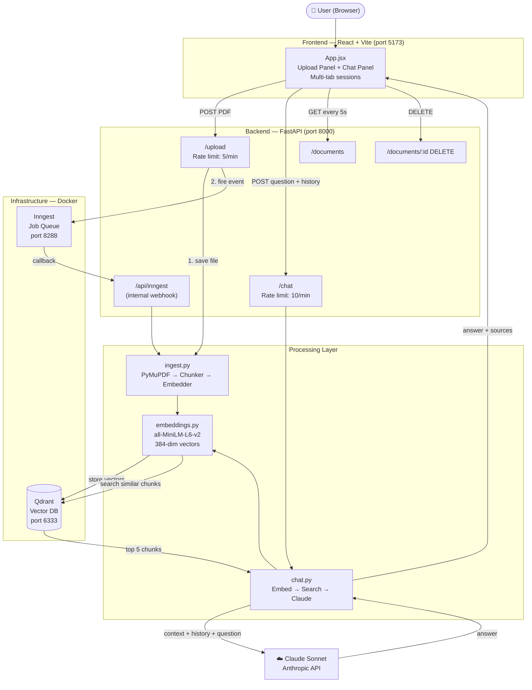
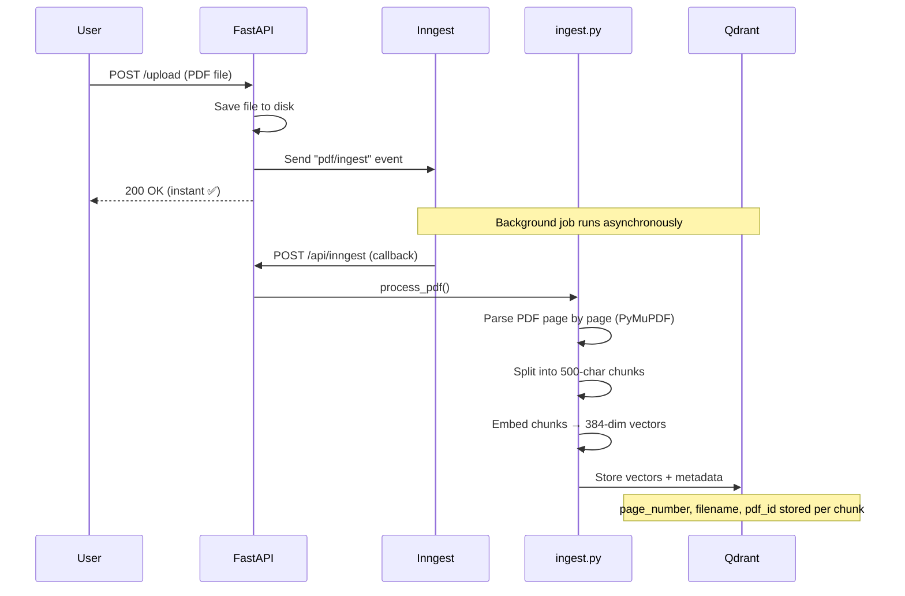
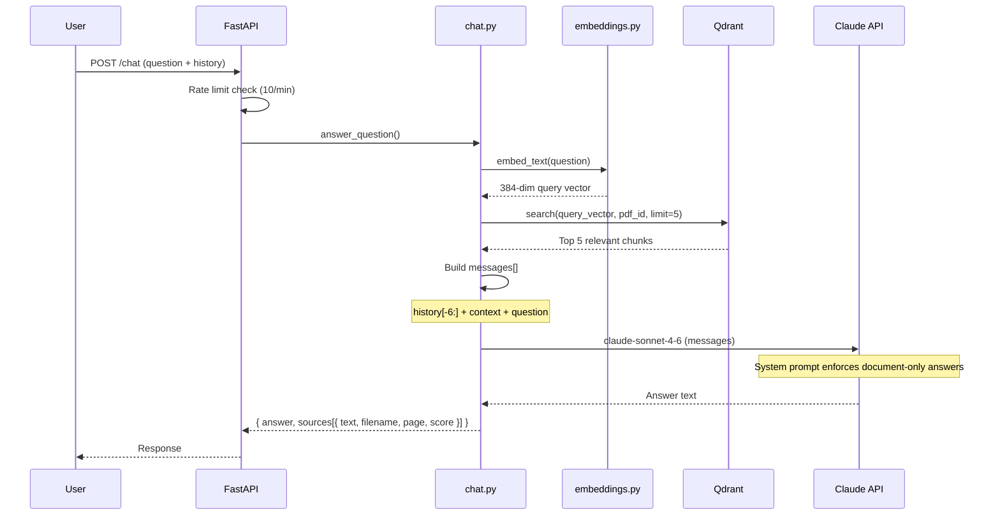

# PDF Chat Agent

A RAG (Retrieval Augmented Generation) application that lets you upload PDF documents and ask questions about them using Claude AI.

## Demo

[https://github.com/user-attachments/assets/demo.mov](https://drive.google.com/file/d/1JtOAvWP7OumteJvJPzMoMAd9YoboCovF/view?usp=drive_link)

## What it does

- Upload one or more PDF files
- Ask questions about the content in natural language
- Get answers grounded in the document with source attribution (filename + page number)
- Maintain conversation context across follow-up questions
- Open multiple independent chat sessions per browser tab

---

## Tech Stack

| Layer | Technology |
|-------|-----------|
| Frontend | React + Vite |
| Backend | FastAPI (Python) |
| Vector Database | Qdrant |
| Background Jobs | Inngest |
| Embedding Model | `all-MiniLM-L6-v2` (local, via sentence-transformers) |
| LLM | Claude Sonnet (Anthropic) |
| Infrastructure | Docker |

---

## Project Structure

```
PDF-Chat-Agent/
├── main.py                        # FastAPI app — all HTTP routes
├── docker-compose.yml             # Qdrant + Inngest dev services
├── pyproject.toml                 # Python dependencies
├── .env                           # Environment variables (not committed)
│
├── services/
│   ├── embeddings.py              # Text → vector conversion
│   ├── ingest.py                  # PDF parse → chunk → embed → store
│   ├── vector_store.py            # Qdrant read/write operations
│   └── chat.py                    # RAG query pipeline (Claude)
│
├── functions/
│   └── inngest_functions.py       # Background job definitions
│
├── frontend/
│   ├── src/
│   │   ├── App.jsx                # Main React UI
│   │   └── App.css                # Styles
│   └── vite.config.js             # Vite config + API proxy
│
└── tests/
    ├── conftest.py                # pytest fixtures
    ├── golden_dataset.json        # Known Q&A pairs for testing
    ├── test_chat.py               # pytest golden dataset tests
    └── eval_ragas.py              # RAGAS quality evaluation script
```

---

## Running Locally — Step by Step

### Step 1 — Install system requirements

You need the following installed on your machine before anything else:

| Tool | Version | Install |
|------|---------|---------|
| Python | 3.9+ | https://python.org/downloads |
| Node.js | 18+ | https://nodejs.org |
| Docker Desktop | latest | https://docker.com/products/docker-desktop |
| `uv` | latest | `pip install uv` |

Verify everything is installed:
```bash
python3 --version      # Python 3.9.x or higher
node --version         # v18.x or higher
docker --version       # Docker 24.x or higher
uv --version           # uv 0.x.x
```

---

### Step 2 — Get an Anthropic API key

1. Go to https://console.anthropic.com
2. Sign up / log in
3. Navigate to **API Keys** → **Create Key**
4. Copy the key — you'll need it in Step 4

---

### Step 3 — Clone the repository

```bash
git clone <repo-url>
cd PDF-Chat-Agent
```

---

### Step 4 — Create the environment file

Copy the example file and fill in your values:

```bash
cp .env.example .env
```

Then open `.env` and replace the placeholder values. The file looks like this:

```env
# Vector DB
QDRANT_URL=http://localhost:6333
QDRANT_COLLECTION=pdf_chunks

# Inngest (these values work for local dev — do not change)
INNGEST_EVENT_KEY=local
INNGEST_SIGNING_KEY=signkey-test-0000000000000000000000000000000000000000000000000000000000000000
INNGEST_BASE_URL=http://localhost:8288

# LLM — paste your Anthropic key here
ANTHROPIC_API_KEY=sk-ant-...

# App
APP_HOST=0.0.0.0
APP_PORT=8000
```

> **Important:** The `INNGEST_SIGNING_KEY` must be exactly as shown — `signkey-test-` followed by 64 hex characters. Any other format causes a startup error.

---

### Step 5 — Install Python dependencies

```bash
uv sync
```

This creates a `.venv` folder and installs all packages from `pyproject.toml`. Takes ~2 minutes on first run (downloads the embedding model).

---

### Step 6 — Install frontend dependencies

```bash
cd frontend
npm install
cd ..
```

---

### Step 7 — Start Docker services (Qdrant + Inngest)

Make sure Docker Desktop is running, then:

```bash
docker compose up -d
```

Verify both containers are running:
```bash
docker compose ps
```

You should see:
```
NAME       STATUS
qdrant     running
inngest    running
```

Confirm Qdrant is up:
```bash
curl http://localhost:6333/healthz
# expected: {"title":"qdrant - vector search engine","version":"..."}
```

---

### Step 8 — Start the backend

Open a terminal in the project root:

```bash
uv run uvicorn main:app --reload --port 8000
```

Confirm it's running by visiting: **http://localhost:8000/health**

Expected response:
```json
{"status": "ok"}
```

Interactive API docs: **http://localhost:8000/docs**

---

### Step 9 — Start the frontend

Open a **second terminal** in the project root:

```bash
cd frontend
npm run dev
```

You should see:
```
VITE ready in Xms
➜  Local: http://localhost:5173/
```

Open **http://localhost:5173** in your browser.

---

### Step 10 — Verify Inngest is connected

Open the Inngest dashboard: **http://localhost:8288**

You should see the app listed as **synced** (green). If it shows as not connected, make sure the backend is running and refresh the Inngest dashboard.

---

### All services at a glance

| Service | URL | What it is |
|---------|-----|-----------|
| Frontend | http://localhost:5173 | React UI |
| Backend API | http://localhost:8000 | FastAPI |
| API Docs | http://localhost:8000/docs | Swagger UI |
| Qdrant | http://localhost:6333 | Vector database |
| Inngest Dashboard | http://localhost:8288 | Background job monitor |

---

### Quick test

1. Open **http://localhost:5173**
2. Click the upload zone and select any PDF
3. Wait ~10–30 seconds for ingestion (watch the Inngest dashboard at port 8288)
4. Click the PDF in the sidebar to select it
5. Type a question and press Enter

---

### Stopping everything

```bash
# stop docker services
docker compose down

# stop backend and frontend with Ctrl+C in their terminals
```

---

### Troubleshooting

**Backend fails to start with `ValueError: non-hexadecimal number found`**
→ Your `INNGEST_SIGNING_KEY` in `.env` is wrong. Use exactly the value shown in Step 4.

**Inngest shows "not synced" in the dashboard**
→ The backend isn't running or isn't reachable. Start the backend first (Step 8), then refresh the Inngest dashboard.

**PDF uploaded but never appears in document list**
→ Inngest job failed. Check the Inngest dashboard at http://localhost:8288 for error details.

**`uv sync` fails**
→ Make sure you're using Python 3.9+. Run `python3 --version` to check.

**Port already in use**
→ Something else is on port 8000, 5173, 6333, or 8288. Stop the conflicting process or change the port in `.env` / `vite.config.js`.

---

## API Endpoints

| Method | Endpoint | Description |
|--------|----------|-------------|
| `POST` | `/upload` | Upload a PDF (rate limited: 5/min) |
| `POST` | `/chat` | Ask a question (rate limited: 10/min) |
| `GET` | `/documents` | List all ingested PDFs |
| `DELETE` | `/documents/{pdf_id}` | Delete a PDF and its vectors |
| `GET` | `/health` | Health check |
| `PUT` | `/api/inngest` | Internal — Inngest job delivery webhook |

Interactive API docs: **http://localhost:8000/docs**

---

## Testing

### Run pytest golden dataset tests

```bash
TEST_PDF_ID=<your-pdf-id> uv run pytest tests/test_chat.py -v
```

### Run RAGAS quality evaluation

```bash
TEST_PDF_ID=<your-pdf-id> uv run python tests/eval_ragas.py
```

RAGAS scores:
- **Faithfulness** — did Claude hallucinate? (1.0 = no hallucination)
- **Context Precision** — were the right chunks retrieved? (1.0 = perfect)
- **Factual Correctness** — do answers match ground truths? (1.0 = perfect)

### Benchmark Results

| Metric | Score | Meaning |
|--------|-------|---------|
| Faithfulness | **1.000** | Zero hallucination — every claim grounded in retrieved chunks |
| Context Precision | **0.795** | Right chunks retrieved and ranked correctly |
| Factual Correctness | **0.702** | Answers match ground truth on golden dataset |

> Evaluated on a 10-question golden dataset using Claude Haiku as the evaluator LLM.
> Scores measured after adding cross-encoder re-ranking and LLM query expansion to the pipeline.

---

## Architecture



---

## PDF Upload Flow



---

## Chat Flow (RAG)



---

## Key Configuration

| Setting | File | Default | Effect |
|---------|------|---------|--------|
| `chunk_size` | `services/ingest.py` | `500` | Larger = more context per chunk |
| `chunk_overlap` | `services/ingest.py` | `50` | Prevents answers being split across chunks |
| `RETRIEVE_K` | `services/chat.py` | `10` | Candidates fetched before re-ranking |
| `RERANK_TOP_K` | `services/chat.py` | `5` | Chunks passed to Claude after re-ranking |
| `HISTORY_WINDOW` | `services/chat.py` | `6` | Messages kept for follow-up context |
| Chat rate limit | `main.py` | `10/minute` | Per IP |
| Upload rate limit | `main.py` | `5/minute` | Per IP |

---

## Retrieval Pipeline

The chat pipeline uses a two-stage retrieve-then-rerank approach:

```
User question
    ↓
Query Expansion (Claude rewrites vague queries into specific search queries)
    ↓
Bi-Encoder Retrieval (embed expanded query → Qdrant top-10)
    ↓
Cross-Encoder Re-ranking (ms-marco-MiniLM-L-6-v2 scores all 10 pairs)
    ↓
Top-5 most relevant chunks → Claude → Answer
```

**Why two stages?**
- Bi-encoders are fast but score question and chunk independently
- Cross-encoders read both texts together (full cross-attention) — significantly more accurate
- Retrieve more (10) → re-rank → pass fewer (5) to Claude keeps cost and latency bounded

---

## Known Limitations & Future Enhancements

| Area | Current State | Next Step |
|------|--------------|-----------|
| Chunk strategy | Fixed 500-char chunks | Semantic/topic-aware chunking for long docs |
| Authentication | pdf_id UUID as capability token | JWT auth + user_id filter in Qdrant |
| Query expansion latency | Extra Claude call per query (~400ms) | Use Haiku for expansion or cache results |
| Response streaming | Full response returned at once | Anthropic streaming API + Server-Sent Events |
| File storage | Local disk (ephemeral on Railway) | S3 or Railway persistent volume |
